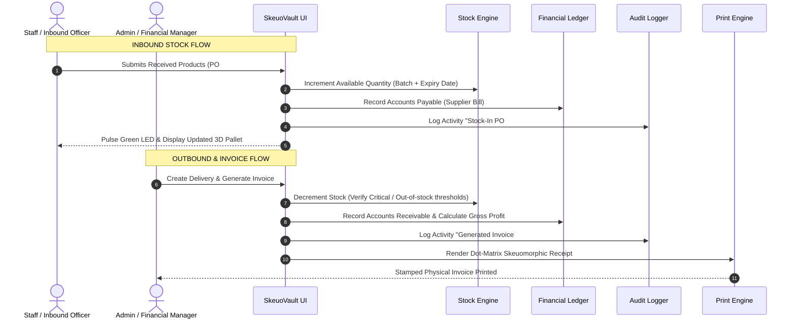
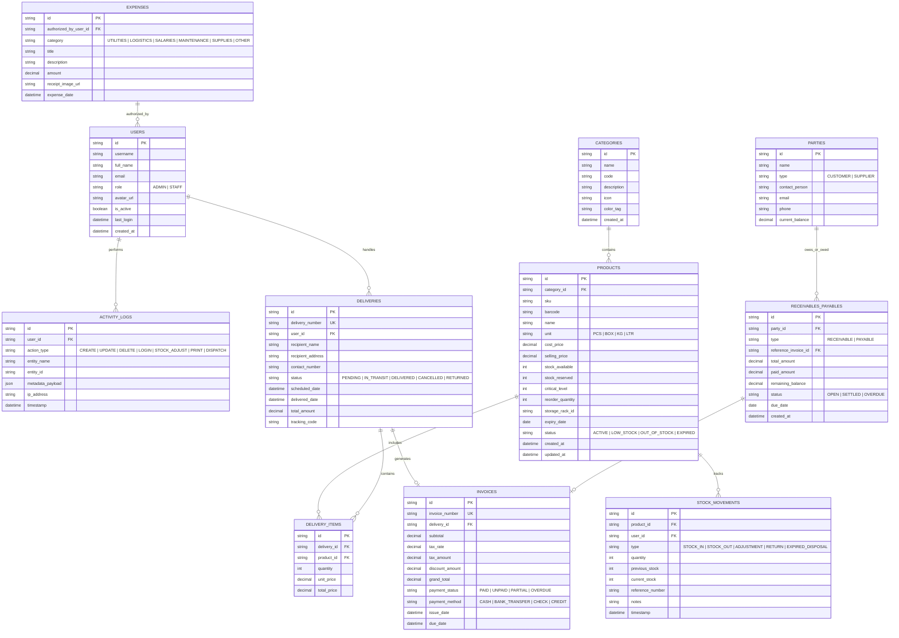
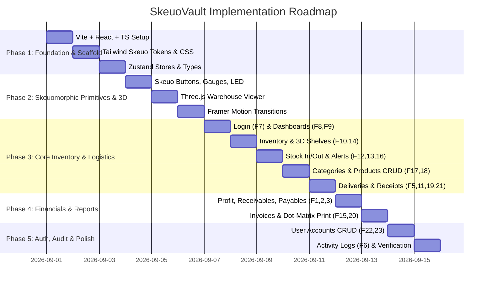

# 📦 SkeuoVault: Next-Gen Skeuomorphic 3D Inventory Management System
> **Comprehensive System Architecture, Project Scaffold, User Stories, Data Models & 3D Design Blueprint**  
> *Target Tech Stack:* **Vite + React + TypeScript + Tailwind CSS + Framer Motion + Three.js / React Three Fiber + shadcn/ui**  
> *Design Paradigm:* **Hyper-Realistic Skeuomorphism, Physical Tactility, Real-time 3D Animations & Spatial Depth**

---

## 📑 Table of Contents
1. [Executive Overview & Design Philosophy](#1-executive-overview--design-philosophy)
2. [Skeuomorphic & 3D Visual System](#2-skeuomorphic--3d-visual-system)
3. [Technology Stack & Core Libraries](#3-technology-stack--core-libraries)
4. [Complete Project Scaffold & Directory Architecture](#4-complete-project-scaffold--directory-architecture)
5. [System Architecture & Data Flow Diagrams](#5-system-architecture--data-flow-diagrams)
6. [Entity Relationship Diagram (ERD) & TypeScript Schemas](#6-entity-relationship-diagram-erd--typescript-schemas)
7. [Comprehensive 23-Feature Matrix & User Stories](#7-comprehensive-23-feature-matrix--user-stories)
8. [Role-Based Access Control (RBAC) Matrix](#8-role-based-access-control-rbac-matrix)
9. [Skeuomorphic Design System & Tailwind CSS Tokens](#9-skeuomorphic-design-system--tailwind-css-tokens)
10. [3D Animations, Transitions & Framer Motion Blueprints](#10-3d-animations-transitions--framer-motion-blueprints)
11. [Agent Execution Roadmap](#11-agent-execution-roadmap)

---

## 1. Executive Overview & Design Philosophy

The **SkeuoVault Inventory Management System** redefines modern enterprise software by marrying **high-utility enterprise stock workflows** with a **rich, tactile Skeuomorphic 3D interface**. 

### 🎯 Core Objectives
* **Tactility Meets Precision:** Physical materials (brushed aluminum, stitched leather dashboards, glass acrylic dials, embossed buttons, physical LED status lamps, stamped paper invoices).
* **Spatial & 3D Interaction:** Dynamic 3D interactive warehouse racks, 3D card deck transitions, isometric stock level monitors, and physical vault-door modals using `@react-three/fiber` & `framer-motion`.
* **Zero Cognitive Fatigue:** Immediate physical metaphors (analog VU gauges for critical stock, real stamped dot-matrix/thermal receipts for invoices, rotary dials for threshold settings).
* **Enterprise Hardened:** Comprehensive coverage of all 23 inventory operations, strict Role-Based Access Control (Admin vs. Staff), automated audit logging, financial ledger tracking (Receivables/Payables/Profits), and print-ready document engines.

---

## 2. Skeuomorphic & 3D Visual System

```
       ┌─────────────────────────────────────────────────────────────┐
       │                 SKEUOMORPHIC AESTHETIC ENGINE               │
       ├──────────────────────────────┬──────────────────────────────┤
       │     MATERIAL TEXTURES        │       3D & SPATIAL DEPTH     │
       │ • Brushed Gunmetal Aluminum  │ • 3D Warehouse Pallet Viewer │
       │ • Dark Walnut & Stitch Wood  │ • 3D Isometric Card Stacks   │
       │ • High-Gloss Acrylic Glass   │ • Vault Lock Flip Transitions│
       │ • Embossed / Engraved Labels │ • Perspective Depth (Z-axis) │
       │ • Heavy Perforated Paper     │ • Spring Physics & Parallax  │
       ├──────────────────────────────┼──────────────────────────────┤
       │      LIGHTING & SHADOWS      │     TACTILE FEEDBACK & LEDS  │
       │ • Dual Inset/Outset Shadows  │ • Push-button Downward Press │
       │ • Ambient Top-Light Bevels   │ • Glowing Neon / Amber LEDs  │
       │ • Specular Edge Glints       │ • Clicky Audio Feedback (Opt)│
       │ • Drop Subsurface Glows      │ • Analog Dial Turn Dampening │
       └──────────────────────────────┴──────────────────────────────┘
```

---

## 3. Technology Stack & Core Libraries

| Layer | Technology | Purpose / Configuration |
|---|---|---|
| **Build Tool** | **Vite (v6+)** | Ultra-fast HMR, optimized TypeScript compilation |
| **UI Framework** | **React 18 / 19** | Strict Mode, Concurrent Features, Suspense |
| **Language** | **TypeScript 5.x** | Strict typing, full interfaces for inventory & ledger entities |
| **Styling** | **Tailwind CSS 3.4+** | Custom skeuomorphic bevels, inset drop shadows, gradient tokens |
| **3D Rendering** | **Three.js + @react-three/fiber + @react-three/drei** | Interactive 3D warehouse isometric shelves, 3D product previews |
| **Animation** | **Framer Motion 11+** | 3D transform transitions, card flips, tactile press physics |
| **UI Components** | **shadcn/ui + Radix UI (Skeuomorphic Styled)** | Accessible primitives styled with physical depth and metallic textures |
| **State Management** | **Zustand + Immer** | Lightweight, reactive centralized state with persistence |
| **Data Querying** | **TanStack Query v5** | Server-state caching, optimistic updates for stock actions |
| **Icons & Visuals**| **Lucide React** | Scalable vector icons styled with embossed relief filters |
| **Charts & Gauges**| **Recharts + Custom Canvas Gauges** | Realistic needle gauges, analog VU meters, financial charts |
| **Print & Invoicing**| **react-to-print + jsPDF** | Thermal receipt, dot-matrix, and embossed invoice generator |
| **Date & Math** | **date-fns + Decimal.js** | Currency precision arithmetic, expiry tracking |

---

## 4. Complete Project Scaffold & Directory Architecture

```plaintext
inventory-skeuovault/
├── index.html
├── package.json
├── tsconfig.json
├── tsconfig.node.json
├── vite.config.ts
├── tailwind.config.js
├── postcss.config.js
├── public/
│   ├── favicon.ico
│   ├── sounds/                     # Optional tactile click/switch audio cues
│   │   ├── click.mp3
│   │   ├── switch.mp3
│   │   └── stamp.mp3
│   └── textures/                   # Skeuomorphic material maps
│       ├── brushed-metal.png
│       ├── carbon-mesh.png
│       ├── paper-fiber.png
│       └── glass-reflection.webp
└── src/
    ├── main.tsx
    ├── App.tsx
    ├── index.css                   # Skeuomorphic tokens, 3D shadows, bevels
    │
    ├── assets/                     # SVGs, 3D models (.glb), branding
    │   ├── models/
    │   │   ├── warehouse-rack.glb
    │   │   └── wooden-crate.glb
    │   └── stamps/
    │       ├── paid-stamp.png
    │       └── expired-stamp.png
    │
    ├── components/                 # Atomic & Skeuomorphic UI Library
    │   ├── 3d/                     # Three.js / React Three Fiber Viewports
    │   │   ├── Warehouse3DScene.tsx
    │   │   ├── StockRack3D.tsx
    │   │   ├── ProductBox3D.tsx
    │   │   └── CanvasContainer.tsx
    │   │
    │   ├── skeuomorphic/           # Tactile Skeuomorphic Primitives
    │   │   ├── SkeuoButton.tsx     # Tactile beveled button with press depth
    │   │   ├── SkeuoCard.tsx       # Metallic/leather bordered card
    │   │   ├── SkeuoInput.tsx      # Inset engraved input field
    │   │   ├── SkeuoSelect.tsx     # Rotary or metallic drop-down
    │   │   ├── SkeuoSwitch.tsx     # Physical toggle switch with specular gloss
    │   │   ├── SkeuoBadge.tsx      # Stamped metal or stitched leather badge
    │   │   ├── SkeuoLED.tsx        # Pulsing Red/Amber/Green LED indicator
    │   │   ├── SkeuoGauge.tsx      # Analog needle meter for stock levels
    │   │   ├── SkeuoVaultModal.tsx # Heavy vault-door opening modal dialog
    │   │   ├── SkeuoTable.tsx      # Grid with carved headers & paper zebra rows
    │   │   └── SkeuoInvoice.tsx    # Dot-matrix / Perforated paper invoice view
    │   │
    │   ├── layout/
    │   │   ├── Header.tsx          # Top brushed-titanium status bar
    │   │   ├── Sidebar.tsx         # Leather-padded tactile navigation rail
    │   │   ├── QuickStatusBar.tsx  # Critical alert LEDs & quick metrics
    │   │   └── PageTransition.tsx  # Framer motion 3D depth flip wrapper
    │   │
    │   └── common/
    │       ├── ConfirmationModal.tsx
    │       ├── SearchFilterBar.tsx
    │       ├── DateRangePicker.tsx
    │       └── PrintContainer.tsx
    │
    ├── config/                     # Application configurations & constants
    │   ├── navigation.ts
    │   ├── permissions.ts
    │   └── constants.ts
    │
    ├── context/                    # React Context providers (Auth, Theme, Sound)
    │   ├── AuthContext.tsx
    │   └── SoundEffectContext.tsx
    │
    ├── hooks/                      # Custom hooks for logic & interaction
    │   ├── useAuth.ts
    │   ├── useInventory.ts
    │   ├── useFinancials.ts
    │   ├── useStockAlerts.ts
    │   ├── use3DControls.ts
    │   └── useSoundEffects.ts
    │
    ├── pages/                      # 23 Feature Implementation Views
    │   ├── auth/
    │   │   └── LoginPage.tsx                    # [Feature 7] Vault login screen
    │   │
    │   ├── admin/
    │   │   ├── AdminDashboard.tsx               # [Feature 8] Master executive dashboard
    │   │   ├── MonthlyProfitReportPage.tsx       # [Feature 1] Financial metrics & margins
    │   │   ├── ReceivablesPayablesPage.tsx      # [Feature 2] Accounts ledger
    │   │   ├── ExpensesManagementPage.tsx       # [Feature 3] Expense logger & receipts
    │   │   ├── ActivityLogsPage.tsx             # [Feature 6] Tamper-proof audit logs
    │   │   ├── AdminAccountsPage.tsx            # [Feature 22] Admin user management
    │   │   └── StaffAccountsPage.tsx            # [Feature 23] Staff user management
    │   │
    │   ├── staff/
    │   │   └── StaffDashboard.tsx               # [Feature 9] Task-oriented operations desk
    │   │
    │   ├── inventory/
    │   │   ├── InventoryOverviewPage.tsx        # [Feature 14] Master catalog & grid
    │   │   ├── StocksMonitoringPage.tsx         # [Feature 10] Real-time visual 3D shelves
    │   │   ├── StockInOutPage.tsx               # [Feature 16] Fast stock adjust / scanner
    │   │   ├── CriticalStockAlertsPage.tsx      # [Feature 12, 13] Out of / Critical alerts
    │   │   ├── ExpiredProductsPage.tsx          # [Feature 4] Shelf-life & expired items
    │   │   ├── CategoriesPage.tsx               # [Feature 17] Category drawer manager
    │   │   ├── ProductsCrudPage.tsx             # [Feature 18] Add/Edit product spec
    │   │   └── PrintInventoryReportPage.tsx     # [Feature 15] Physical sheet print export
    │   │
    │   ├── delivery/
    │   │   ├── AddDeliveryPage.tsx              # [Feature 19] Dispatch new shipment
    │   │   ├── DeliveryReportsPage.tsx          # [Feature 5] Logistics track & ledger
    │   │   ├── TotalProductsDeliveryPage.tsx    # [Feature 11] Bulk delivery summary
    │   │   ├── ReceivedProductsPage.tsx         # [Feature 21] Inbound delivery intake
    │   │   └── InvoicePrintPage.tsx             # [Feature 20] Realistic printable invoice
    │   │
    │   └── not-found/
    │       └── NotFoundPage.tsx
    │
    ├── services/                   # Business logic, API/mock, storage engines
    │   ├── storage/
    │   │   ├── mockData.ts                      # Rich realistic seed dataset
    │   │   ├── localStorageAdapter.ts
    │   │   └── db.ts                            # IndexedDB / LocalStorage or Backend API
    │   ├── authService.ts
    │   ├── inventoryService.ts
    │   ├── financialService.ts
    │   ├── deliveryService.ts
    │   ├── reportService.ts
    │   └── auditLogService.ts
    │
    ├── store/                      # Zustand State Stores
    │   ├── useAuthStore.ts
    │   ├── useInventoryStore.ts
    │   ├── useDeliveryStore.ts
    │   ├── useFinancialStore.ts
    │   ├── useAlertStore.ts
    │   └── useUIStore.ts
    │
    ├── types/                      # TypeScript definitions for all domains
    │   ├── auth.ts
    │   ├── inventory.ts
    │   ├── delivery.ts
    │   ├── financial.ts
    │   ├── audit.ts
    │   └── reports.ts
    │
    └── utils/                      # Helper utilities
        ├── formatters.ts           # Currency, stock units, date formatting
        ├── mathHelpers.ts          # Profit margin, tax, reorder point calc
        ├── skeuoClasses.ts         # Dynamic class constructors for bevels/glows
        └── pdfGenerator.ts         # Document rendering & print utilities
```

---

## 5. System Architecture & Data Flow Diagrams

### High-Level System Architecture

```mermaid
flowchart TD
    subgraph CLIENT_TIER [Client Presentation Tier (React + Vite + Three.js)]
        UI[Skeuomorphic React UI Components]
        R3F[React Three Fiber 3D Stock Canvas]
        FM[Framer Motion 3D Physics Engine]
        PRINT[Thermal / Dot-Matrix Print Engine]
    end

    subgraph STATE_TIER [Centralized Application & Query State]
        ZUSTAND[Zustand Stores with Local/IndexedDB Persistence]
        AUTH_ST[Auth & Session Store (Admin / Staff)]
        INV_ST[Inventory & Movement Store]
        FIN_ST[Financials & Ledger Store]
        DELIV_ST[Delivery & Invoice Store]
        AUDIT_ST[Tamper-Proof Activity Logger]
    end

    subgraph SERVICE_TIER [Domain Service & Calculation Engines]
        AUTH_SVC[Auth & RBAC Interceptor]
        STOCK_ENGINE[FIFO Stock Evaluator & Expiry Tracker]
        ALERT_ENGINE[Critical Stock & Out-of-Stock LED Monitor]
        FIN_ENGINE[Profit / Receivable / Payable / Expense Calculator]
        INVOICE_ENGINE[Invoice & Barcode Generator]
        LOG_ENGINE[Immutable Audit Trail Service]
    end

    subgraph PERSISTENCE_TIER [Storage & Persistence Layer]
        LOCAL_STORAGE[(LocalStorage / IndexedDB Engine)]
        API_LAYER[(REST / GraphQL / Supabase Backend API)]
    end

    UI --> ZUSTAND
    R3F --> INV_ST
    FM --> UI
    PRINT --> DELIV_ST

    ZUSTAND --> AUTH_ST & INV_ST & FIN_ST & DELIV_ST & AUDIT_ST

    AUTH_ST --> AUTH_SVC
    INV_ST --> STOCK_ENGINE & ALERT_ENGINE
    FIN_ST --> FIN_ENGINE
    DELIV_ST --> INVOICE_ENGINE
    AUDIT_ST --> LOG_ENGINE

    SERVICE_TIER --> PERSISTENCE_TIER
```

### Stock Lifecycle & Invoicing Flow



---

## 6. Entity Relationship Diagram (ERD) & TypeScript Schemas

### Mermaid ERD



### Master TypeScript Entity Definitions (`src/types/index.ts`)

```typescript
// ==========================================
// USER & AUTH DOMAIN
// ==========================================
export type UserRole = 'ADMIN' | 'STAFF';

export interface User {
  id: string;
  username: string;
  fullName: string;
  email: string;
  role: UserRole;
  avatarUrl?: string;
  isActive: boolean;
  lastLogin?: string;
  createdAt: string;
}

// ==========================================
// INVENTORY & CATEGORY DOMAIN
// ==========================================
export type StockStatus = 'IN_STOCK' | 'CRITICAL' | 'OUT_OF_STOCK' | 'EXPIRED';
export type UnitOfMeasure = 'PCS' | 'BOX' | 'PACK' | 'KG' | 'LTR' | 'MTR';

export interface Category {
  id: string;
  name: string;
  code: string;
  description?: string;
  iconName: string;
  colorTag: string;
  productCount?: number;
  createdAt: string;
}

export interface Product {
  id: string;
  categoryId: string;
  categoryName?: string;
  sku: string;
  barcode: string;
  name: string;
  description?: string;
  unit: UnitOfMeasure;
  costPrice: number;
  sellingPrice: number;
  stockAvailable: number;
  stockReserved: number;
  criticalLevel: number;
  reorderQuantity: number;
  storageRackId: string;
  expiryDate?: string;
  status: StockStatus;
  imageUrl?: string;
  createdAt: string;
  updatedAt: string;
}

export type MovementType = 
  | 'STOCK_IN' 
  | 'STOCK_OUT' 
  | 'ADJUSTMENT' 
  | 'DAMAGED' 
  | 'RETURN' 
  | 'EXPIRED_DISPOSAL';

export interface StockMovement {
  id: string;
  productId: string;
  productName: string;
  sku: string;
  userId: string;
  userName: string;
  type: MovementType;
  quantity: number;
  previousStock: number;
  currentStock: number;
  referenceNumber: string;
  notes?: string;
  timestamp: string;
}

// ==========================================
// DELIVERY & INVOICE DOMAIN
// ==========================================
export type DeliveryStatus = 'PENDING' | 'DISPATCHED' | 'DELIVERED' | 'CANCELLED' | 'RETURNED';

export interface DeliveryItem {
  id: string;
  productId: string;
  productName: string;
  sku: string;
  quantity: number;
  unitPrice: number;
  totalPrice: number;
}

export interface Delivery {
  id: string;
  deliveryNumber: string;
  userId: string;
  dispatcherName: string;
  recipientName: string;
  recipientAddress: string;
  contactNumber: string;
  items: DeliveryItem[];
  totalQuantity: number;
  totalAmount: number;
  status: DeliveryStatus;
  scheduledDate: string;
  deliveredDate?: string;
  trackingCode: string;
  notes?: string;
}

export type PaymentStatus = 'PAID' | 'UNPAID' | 'PARTIAL' | 'OVERDUE';
export type PaymentMethod = 'CASH' | 'BANK_TRANSFER' | 'CHECK' | 'CARD';

export interface Invoice {
  id: string;
  invoiceNumber: string;
  deliveryId?: string;
  customerName: string;
  customerAddress: string;
  customerPhone?: string;
  items: DeliveryItem[];
  subtotal: number;
  taxRate: number;
  taxAmount: number;
  discountAmount: number;
  grandTotal: number;
  paymentStatus: PaymentStatus;
  paymentMethod: PaymentMethod;
  issueDate: string;
  dueDate: string;
  notes?: string;
}

// ==========================================
// FINANCIAL & EXPENSE DOMAIN
// ==========================================
export type LedgerPartyType = 'CUSTOMER' | 'SUPPLIER';
export type LedgerEntryType = 'RECEIVABLE' | 'PAYABLE';
export type LedgerStatus = 'OPEN' | 'PARTIALLY_SETTLED' | 'SETTLED' | 'OVERDUE';

export interface ReceivablesPayablesEntry {
  id: string;
  partyName: string;
  partyType: LedgerPartyType;
  type: LedgerEntryType;
  invoiceOrPoRef: string;
  totalAmount: number;
  paidAmount: number;
  remainingBalance: number;
  status: LedgerStatus;
  dueDate: string;
  createdAt: string;
}

export type ExpenseCategory = 
  | 'UTILITIES' 
  | 'LOGISTICS' 
  | 'SALARIES' 
  | 'EQUIPMENT_MAINTENANCE' 
  | 'WAREHOUSE_SUPPLIES' 
  | 'MARKETING' 
  | 'MISCELLANEOUS';

export interface Expense {
  id: string;
  authorizedByUserId: string;
  authorizerName: string;
  category: ExpenseCategory;
  title: string;
  description?: string;
  amount: number;
  receiptImageUrl?: string;
  expenseDate: string;
  createdAt: string;
}

export interface MonthlyProfitReport {
  month: string; // "2026-09"
  grossRevenue: number;
  cogs: number; // Cost of Goods Sold
  grossProfit: number;
  totalExpenses: number;
  netProfit: number;
  profitMarginPercent: number;
  totalDeliveriesCompleted: number;
  totalStockValue: number;
}

// ==========================================
// AUDIT & ACTIVITY LOG DOMAIN
// ==========================================
export type ActivityActionType = 
  | 'USER_LOGIN'
  | 'USER_LOGOUT'
  | 'PRODUCT_CREATE'
  | 'PRODUCT_UPDATE'
  | 'PRODUCT_DELETE'
  | 'CATEGORY_CHANGE'
  | 'STOCK_IN'
  | 'STOCK_OUT'
  | 'DELIVERY_DISPATCH'
  | 'DELIVERY_RECEIVE'
  | 'INVOICE_GENERATED'
  | 'EXPENSE_RECORDED'
  | 'REPORT_PRINTED';

export interface ActivityLog {
  id: string;
  userId: string;
  userName: string;
  userRole: UserRole;
  action: ActivityActionType;
  entityName: string;
  entityId: string;
  description: string;
  payload?: Record<string, unknown>;
  ipAddress?: string;
  timestamp: string;
}
```

---

## 7. Comprehensive 23-Feature Matrix & User Stories

| # | Feature Name | Core Role | User Story & Acceptance Criteria | Skeuomorphic & 3D Visual Experience |
|---|---|---|---|---|
| **1** | **Monthly Profit Report** | `ADMIN` | *As an Admin, I want to calculate Net Profit (Revenue - COGS - Expenses) over monthly ranges so I can audit business health.*<br>• Acc: Calculates Gross Sales, COGS, Net Margins, Month-over-Month % change. | Vintage green phosphor terminal readout + Brushed bronze executive ledger frame + Animated gold-inlaid bar graphs. |
| **2** | **Receivables & Payables** | `ADMIN` | *As an Admin, I want to manage money owed by customers and owed to suppliers.*<br>• Acc: Filter by Due Date, record partial payments, flag overdue status. | Physical dual-pocket balance ledger card with red (payable) and green (receivable) debossed tabs. |
| **3** | **Expenses Management** | `ADMIN` | *As an Admin, I want to categorize and log operational expenses with receipts.*<br>• Acc: Add expense amount, category, receipt upload, real-time deduction from net profit. | Clip-board document holder with realistic paper receipts and physical rubber stamp status. |
| **4** | **Expired Products List** | `ADMIN` / `STAFF` | *As an Operator, I want immediate visibility into expired and expiring-soon goods.*<br>• Acc: Highlight items past shelf life, 1-click disposal stock-out workflow. | Weathered/aged label texture with a deep red glowing hazardous warning light and stamp. |
| **5** | **Delivery Reports** | `ADMIN` / `STAFF` | *As an Operator, I want a log of all shipments, drivers, dispatch times, and fulfillment rates.*<br>• Acc: Date range filter, driver filter, export/print summary. | Clipboard logistics report with metal binder ring animations and vehicle odometer visual meters. |
| **6** | **Activity Logs** | `ADMIN` | *As an Admin, I want a tamper-proof chronological audit trail of all staff and system operations.*<br>• Acc: Records user, timestamp, action type, IP, and diff data. | Mechanical ticker-tape printout animation with timestamp embossing and security seal. |
| **7** | **Login Page** | `PUBLIC` | *As a User, I want a secure authentication portal with role redirection.*<br>• Acc: Supports Admin & Staff credentials, validation error shakes, session persistence. | Heavy mechanical vault door with rotating combination lock dial, metallic inputs, and glowing neon keys. |
| **8** | **Admin Dashboard** | `ADMIN` | *As an Admin, I want a top-level command center with real-time KPI dials, alarms, and quick actions.*<br>• Acc: Shows stock value, monthly profit, critical alerts, pending deliveries. | Luxury stitched leather dashboard backing, analog needle dials, LED alert panel, and 3D summary cards. |
| **9** | **Staff Dashboard** | `STAFF` | *As a Staff member, I want an operational view focused on daily stock-in/out, deliveries, and item lookup.*<br>• Acc: Quick barcode scanner search, active delivery checklist, quick stock adjustments. | Tactical industrial brushed aluminum control console with prominent push buttons and barcode laser beam. |
| **10** | **Stocks Monitoring** | `ADMIN` / `STAFF` | *As an Operator, I want real-time stock levels with 3D spatial visualization.*<br>• Acc: Live stock count, warehouse rack location tracker, status categorization. | **Interactive 3D Three.js Warehouse Shelf**: click on shelves to view stock box stacks and levels. |
| **11** | **Total Products Delivery** | `ADMIN` / `STAFF` | *As a Manager, I want an aggregated total metric of products delivered across timeframes.*<br>• Acc: Sum total units dispatched per category and revenue generated. | Analog counter/odometer rolling number reels that smoothly tick upward on page load. |
| **12** | **Out of Stocks Notification**| `ADMIN` / `STAFF` | *As an Operator, I want instant high-priority alert when an item reaches 0 quantity.*<br>• Acc: Pulsing alert banner, push notification, audio alert toggle, quick reorder link. | Flashing siren red LED lamp with physical toggle silencer switch and emergency glass casing. |
| **13** | **Critical Stocks Notification**| `ADMIN` / `STAFF` | *As an Operator, I want warning alerts when products fall below their critical threshold.*<br>• Acc: Configurable threshold per SKU, amber warning badge, auto-reorder calculation. | Amber vacuum-tube glow light + analog dial indicator showing needle entering critical danger zone. |
| **14** | **Inventory Management** | `ADMIN` / `STAFF` | *As an Operator, I want a master catalog table with search, filters, pagination, and multi-actions.*<br>• Acc: Filter by category/status, sort by price/qty, bulk export to CSV/PDF. | Heavy oak filing cabinet drawer UI with physical indexing tabs that slide out in 3D perspective. |
| **15** | **Print Inventory Report** | `ADMIN` / `STAFF` | *As an Operator, I want a formatted, print-optimized document of current inventory.*<br>• Acc: Clean pagination, stock summary, barcodes, valuation totals. | Stamped parchment/paper report preview with realistic page-fold animations and print trigger. |
| **16** | **Stock-In / Stock-Out / Available** | `STAFF` / `ADMIN` | *As a Staff member, I want to quickly increment/decrement stock with reason codes.*<br>• Acc: Positive/negative adjustment, reference PO/SO #, immediate available stock recalculation. | Dual heavy hydraulic lever switches (Green for Stock-In, Red for Stock-Out) with tactile push. |
| **17** | **Add/Update/Delete Category**| `ADMIN` | *As an Admin, I want to manage product categories and custom icon tags.*<br>• Acc: CRUD modal with color badges, validation preventing deletion of populated categories. | Modular metallic nameplate slots with magnetic click animations. |
| **18** | **Add/Update/Delete Products**| `ADMIN` | *As an Admin, I want complete control over SKU creation, barcode, pricing, rack location & photos.*<br>• Acc: Full product modal, validation, auto-generated SKU/barcode, price margin calculator. | Physical blueprint / spec sheet form with engraved input recesses and wax stamp save confirmation. |
| **19** | **Add Delivery** | `ADMIN` / `STAFF` | *As an Operator, I want to generate a new dispatch order with multiple line items.*<br>• Acc: Recipient info, product picker with stock reservation check, auto-calculated total. | Dispatch manifest clip-board with physical pen signature pad and dynamic packing list. |
| **20** | **Generate/Print Invoice Report**| `ADMIN` / `STAFF` | *As an Operator, I want to generate a branded invoice for orders with payment status.*<br>• Acc: Auto-calculates tax, discounts, barcode, and one-click thermal/A4 print. | Continuous-feed dot-matrix printer receipt with perforated tear effect and authentic stamp overlays. |
| **21** | **Received Products** | `STAFF` / `ADMIN` | *As a Receiving Officer, I want to log inbound shipments and verify against Purchase Orders.*<br>• Acc: Batch expiry assignment, warehouse rack mapping, automatic inventory increment. | Unboxing crate visualizer with 3D lid lift animation and digital manifest check-off. |
| **22** | **Add/Update/Delete Admin Accounts**| `ADMIN` | *As a Super Admin, I want to provision and audit administrative credentials.*<br>• Acc: Role assignment, password reset, account deactivation, permission guard. | High-security keycard badge holder with gold-plated executive insignia and authorization stamp. |
| **23** | **Add/Update/Delete Staff Accounts**| `ADMIN` | *As an Admin, I want to provision warehouse staff accounts and manage their status.*<br>• Acc: Create staff logins, track last active session, toggle active status. | Industrial punch-card employee ID badge interface with physical switch toggles. |

---

## 8. Role-Based Access Control (RBAC) Matrix

| Feature Module | Admin Permission | Staff Permission | Route Guard |
|---|:---:|:---:|---|
| **1. Monthly Profit Report** | Full Access (View, Export, Filter) | 🚫 Restricted | `AdminOnly` |
| **2. Receivables & Payables** | Full Access (Create, Settle, View) | 🚫 Restricted | `AdminOnly` |
| **3. Expenses Management** | Full Access (Create, Delete, View) | 🚫 Restricted | `AdminOnly` |
| **4. Expired Products List** | Full Access + Dispose Action | View & Report Only | `Shared` |
| **5. Delivery Reports** | Full Access | View & Print Only | `Shared` |
| **6. Activity Logs** | Full Access (Filter, Audit) | 🚫 Restricted | `AdminOnly` |
| **7. Login Page** | Public Authentication Portal | Public Authentication Portal | `Public` |
| **8. Admin Dashboard** | Full Access | 🚫 Restricted (Redirect to Staff) | `AdminOnly` |
| **9. Staff Dashboard** | Viewable | Default Workspace | `Shared` |
| **10. Stocks Monitoring (3D)**| Full Access | Full Access | `Shared` |
| **11. Total Products Delivery**| Full Access | Full Access | `Shared` |
| **12. Out of Stocks Alerts** | Full Access + Reorder Config | View & Acknowledge | `Shared` |
| **13. Critical Stocks Alerts** | Full Access + Threshold Config| View & Acknowledge | `Shared` |
| **14. Inventory Management** | Full Access | View, Search, Filter | `Shared` |
| **15. Print Inventory Report** | Full Access | Full Access | `Shared` |
| **16. Stock-In / Stock-Out** | Full Access | Full Access (Execution) | `Shared` |
| **17. Category CRUD** | Full Access | View Only | `AdminOnly` |
| **18. Product CRUD** | Full Access (Add/Edit/Delete) | View Only | `AdminOnly` |
| **19. Add Delivery** | Full Access | Full Access | `Shared` |
| **20. Generate/Print Invoice** | Full Access | Full Access | `Shared` |
| **21. Received Products** | Full Access | Full Access | `Shared` |
| **22. Admin Accounts CRUD** | Full Access (Super Admin) | 🚫 Restricted | `AdminOnly` |
| **23. Staff Accounts CRUD** | Full Access | 🚫 Restricted | `AdminOnly` |

---

## 9. Skeuomorphic Design System & Tailwind CSS Tokens

### Tailwind CSS Configuration (`tailwind.config.js`)

```javascript
/** @type {import('tailwindcss').Config} */
export default {
  darkMode: ['class'],
  content: ['./index.html', './src/**/*.{js,ts,jsx,tsx}'],
  theme: {
    extend: {
      colors: {
        skeuo: {
          dark: '#121418',
          charcoal: '#1c1f26',
          metal: '#2a2e39',
          chrome: '#e2e8f0',
          leather: '#241a15',
          gold: '#d4af37',
          amber: '#f59e0b',
          neonRed: '#ef4444',
          neonGreen: '#10b981',
          paper: '#fcfbf7',
          paperAged: '#f4ede2',
        },
      },
      boxShadow: {
        // Physical Skeuomorphic Bevel & Drop Shadows
        'skeuo-button': '0 4px 6px -1px rgba(0, 0, 0, 0.5), inset 0 1px 0 rgba(255, 255, 255, 0.25), inset 0 -2px 4px rgba(0, 0, 0, 0.4)',
        'skeuo-button-pressed': 'inset 0 4px 8px rgba(0, 0, 0, 0.7), inset 0 1px 2px rgba(0, 0, 0, 0.9), 0 1px 1px rgba(255, 255, 255, 0.1)',
        'skeuo-panel': '0 20px 25px -5px rgba(0, 0, 0, 0.6), 0 8px 10px -6px rgba(0, 0, 0, 0.5), inset 0 1px 1px rgba(255, 255, 255, 0.15)',
        'skeuo-card': '0 10px 15px -3px rgba(0, 0, 0, 0.4), inset 0 1px 0 rgba(255, 255, 255, 0.1), inset 0 0 0 1px rgba(255, 255, 255, 0.05)',
        'skeuo-inset': 'inset 0 3px 6px rgba(0, 0, 0, 0.6), inset 0 1px 2px rgba(0, 0, 0, 0.8), 0 1px 0 rgba(255, 255, 255, 0.08)',
        'skeuo-led-green': '0 0 12px #10b981, inset 0 1px 2px rgba(255,255,255,0.8)',
        'skeuo-led-red': '0 0 14px #ef4444, inset 0 1px 2px rgba(255,255,255,0.8)',
        'skeuo-led-amber': '0 0 12px #f59e0b, inset 0 1px 2px rgba(255,255,255,0.8)',
        'skeuo-paper': '0 15px 30px rgba(0,0,0,0.35), 0 5px 15px rgba(0,0,0,0.2)',
      },
      backgroundImage: {
        'brushed-metal': 'linear-gradient(135deg, #2e3440 0%, #1e222a 50%, #2e3440 100%)',
        'metallic-gold': 'linear-gradient(135deg, #dfba4e 0%, #c49b2c 50%, #e8cb69 100%)',
        'leather-texture': 'radial-gradient(circle at 50% 50%, #2c201a 0%, #1a120e 100%)',
        'acrylic-glass': 'linear-gradient(135deg, rgba(255, 255, 255, 0.12) 0%, rgba(255, 255, 255, 0.02) 100%)',
      },
    },
  },
  plugins: [],
};
```

### Core Skeuomorphic Component Blueprint (`src/components/skeuomorphic/SkeuoButton.tsx`)

```tsx
import React from 'react';
import { motion, HTMLMotionProps } from 'framer-motion';

interface SkeuoButtonProps extends HTMLMotionProps<'button'> {
  variant?: 'metal' | 'gold' | 'danger' | 'success';
  size?: 'sm' | 'md' | 'lg';
  ledStatus?: 'green' | 'red' | 'amber' | 'off';
  children: React.ReactNode;
}

export const SkeuoButton: React.FC<SkeuoButtonProps> = ({
  variant = 'metal',
  size = 'md',
  ledStatus = 'off',
  children,
  className = '',
  ...props
}) => {
  const variantStyles = {
    metal: 'bg-gradient-to-b from-[#3a4150] via-[#2a2f3b] to-[#1f232c] text-gray-200 border-t border-gray-400/30 border-b border-black/80 shadow-skeuo-button',
    gold: 'bg-gradient-to-b from-[#f3d068] via-[#cca332] to-[#99771a] text-black font-semibold border-t border-yellow-200/60 border-b border-yellow-950 shadow-skeuo-button',
    danger: 'bg-gradient-to-b from-[#ef4444] via-[#b91c1c] to-[#7f1d1d] text-white border-t border-red-300/40 border-b border-red-950 shadow-skeuo-button',
    success: 'bg-gradient-to-b from-[#10b981] via-[#047857] to-[#064e3b] text-white border-t border-emerald-300/40 border-b border-emerald-950 shadow-skeuo-button',
  };

  const sizeStyles = {
    sm: 'px-3 py-1.5 text-xs rounded-md',
    md: 'px-5 py-2.5 text-sm rounded-lg',
    lg: 'px-7 py-3.5 text-base rounded-xl',
  };

  const ledColor = {
    green: 'bg-emerald-400 shadow-skeuo-led-green',
    red: 'bg-rose-500 shadow-skeuo-led-red',
    amber: 'bg-amber-400 shadow-skeuo-led-amber',
    off: 'bg-gray-700 opacity-40',
  };

  return (
    <motion.button
      whileHover={{ translateY: -1.5, filter: 'brightness(1.08)' }}
      whileTap={{ translateY: 2, filter: 'brightness(0.92)' }}
      transition={{ type: 'spring', stiffness: 500, damping: 25 }}
      className={`relative inline-flex items-center justify-center gap-2 select-none active:shadow-skeuo-button-pressed font-medium tracking-wide transition-all ${variantStyles[variant]} ${sizeStyles[size]} ${className}`}
      {...props}
    >
      {ledStatus !== 'off' && (
        <span className={`w-2 h-2 rounded-full ring-1 ring-black/40 ${ledColor[ledStatus]}`} />
      )}
      {children}
    </motion.button>
  );
};
```

---

## 10. 3D Animations, Transitions & Framer Motion Blueprints

### Interactive 3D Warehouse Pallet Viewer (`src/components/3d/Warehouse3DScene.tsx`)

```tsx
import React, { useRef } from 'react';
import { Canvas, useFrame } from '@react-three/fiber';
import { OrbitControls, RoundedBox, Text, Float } from '@react-three/drei';
import * as THREE from 'three';

interface RackSlotProps {
  position: [number, number, number];
  sku: string;
  count: number;
  criticalLevel: number;
  label: string;
}

const RackPalletBox: React.FC<RackSlotProps> = ({ position, count, criticalLevel, label }) => {
  const meshRef = useRef<THREE.Mesh>(null!);
  const isCritical = count <= criticalLevel;
  const isOutOfStock = count === 0;

  const boxColor = isOutOfStock ? '#ef4444' : isCritical ? '#f59e0b' : '#3b82f6';

  useFrame((state) => {
    if (isCritical && !isOutOfStock) {
      meshRef.current.position.y = position[1] + Math.sin(state.clock.elapsedTime * 3) * 0.04;
    }
  });

  return (
    <group position={position}>
      {/* 3D Pallet Base */}
      <RoundedBox args={[1.2, 0.1, 1.2]} radius={0.02} smoothness={4} position={[0, -0.45, 0]}>
        <meshStandardMaterial color="#854d0e" roughness={0.8} />
      </RoundedBox>

      {/* Stock Box Container */}
      {!isOutOfStock ? (
        <RoundedBox ref={meshRef} args={[1, 0.8, 1]} radius={0.04} smoothness={4}>
          <meshStandardMaterial color={boxColor} roughness={0.3} metalness={0.4} />
        </RoundedBox>
      ) : (
        /* Empty Wireframe Indicator */
        <RoundedBox args={[1, 0.8, 1]} radius={0.04} smoothness={4}>
          <meshBasicMaterial color="#ef4444" wireframe />
        </RoundedBox>
      )}

      {/* 3D Floating Stock Label */}
      <Float speed={1.5} rotationIntensity={0.2} floatIntensity={0.2}>
        <Text
          position={[0, 0.65, 0]}
          fontSize={0.16}
          color="#ffffff"
          anchorX="center"
          anchorY="middle"
        >
          {`${label} (${count})`}
        </Text>
      </Float>
    </group>
  );
};

export const Warehouse3DScene: React.FC<{ products: Array<any> }> = ({ products }) => {
  return (
    <div className="w-full h-80 rounded-2xl overflow-hidden bg-gradient-to-b from-[#111317] to-[#1e232d] border border-gray-700/50 shadow-skeuo-panel relative">
      <div className="absolute top-4 left-4 z-10 bg-black/60 backdrop-blur-md px-3 py-1.5 rounded-lg border border-white/10 text-xs font-mono text-gray-300">
        📦 3D Spatial Warehouse View (Orbit to rotate / Scroll to zoom)
      </div>
      <Canvas camera={{ position: [4, 4, 6], fov: 45 }}>
        <ambientLight intensity={0.7} />
        <directionalLight position={[10, 15, 10]} intensity={1.2} castShadow />
        <pointLight position={[-10, 5, -10]} intensity={0.5} color="#60a5fa" />
        
        {/* Metal Rack Pillars */}
        <mesh position={[-2, 0, -2]}>
          <cylinderGeometry args={[0.06, 0.06, 4]} />
          <meshStandardMaterial color="#475569" metalness={0.8} />
        </mesh>
        <mesh position={[2, 0, -2]}>
          <cylinderGeometry args={[0.06, 0.06, 4]} />
          <meshStandardMaterial color="#475569" metalness={0.8} />
        </mesh>

        {/* Dynamic Pallet Slots */}
        {products.slice(0, 3).map((prod, idx) => (
          <RackPalletBox
            key={prod.id || idx}
            position={[(idx - 1) * 1.8, 0, 0]}
            sku={prod.sku}
            count={prod.stockAvailable}
            criticalLevel={prod.criticalLevel}
            label={prod.name}
          />
        ))}

        <OrbitControls enablePan={true} maxPolarAngle={Math.PI / 2.1} minDistance={3} maxDistance={12} />
      </Canvas>
    </div>
  );
};
```

### 3D Vault Door Page Transition (`src/components/layout/PageTransition.tsx`)

```tsx
import React from 'react';
import { motion, AnimatePresence } from 'framer-motion';

export const PageTransition: React.FC<{ children: React.ReactNode; pageKey: string }> = ({
  children,
  pageKey,
}) => {
  return (
    <AnimatePresence mode="wait">
      <motion.div
        key={pageKey}
        initial={{ opacity: 0, rotateY: -12, scale: 0.96, zIndex: 0 }}
        animate={{ opacity: 1, rotateY: 0, scale: 1, zIndex: 1 }}
        exit={{ opacity: 0, rotateY: 12, scale: 0.96, zIndex: 0 }}
        transition={{
          duration: 0.45,
          ease: [0.22, 1, 0.36, 1], // Cubic-bezier authentic hydraulic door glide
        }}
        style={{ perspective: 1200, transformStyle: 'preserve-3d' }}
        className="w-full h-full"
      >
        {children}
      </motion.div>
    </AnimatePresence>
  );
};
```

---

## 11. Agent Execution Roadmap

Any autonomous Agent or Developer building this project should execute along the following 5 phases:



### Direct Quickstart Commands
```bash
# 1. Initialize Vite project with React & TypeScript
npm create vite@latest . -- --template react-ts

# 2. Install Skeuomorphic, 3D and Animation dependencies
npm install clsx tailwind-merge lucide-react framer-motion three @react-three/fiber @react-three/drei zustand date-fns recharts react-to-print jspdf

# 3. Install Dev Dependencies
npm install -D tailwindcss postcss autoprefixer @types/three

# 4. Start Development Server
npm run dev
```

---
*Created for the SkeuoVault Inventory Management System Architecture.*
